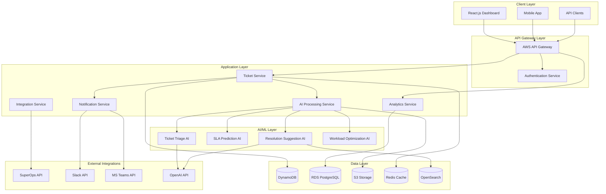

# Design Document

## Overview

The AI-powered ticket management platform is built as a cloud-native, microservices-based system that leverages artificial intelligence to automate and optimize MSP operations. The platform follows a serverless-first architecture using AWS services, with React.js frontend, Node.js/FastAPI backend services, and multiple AI models for different use cases.

The system is designed for horizontal scalability, real-time processing, and seamless integration with existing MSP tools. It employs event-driven architecture with message queues for reliable processing and maintains high availability through distributed design patterns.

## Architecture

### High-Level System Architecture



### Deployment Architecture

The system uses AWS serverless architecture for automatic scaling and cost optimization:

- **AWS Lambda Functions**: Core business logic and AI processing
- **AWS API Gateway**: Request routing and rate limiting
- **AWS EventBridge**: Event-driven communication between services
- **AWS SQS/SNS**: Message queuing and notifications
- **AWS CloudFront**: CDN for frontend assets
- **AWS Cognito**: User authentication and authorization

## Components and Interfaces

### Frontend Components

#### Dashboard Application (React.js + Tailwind CSS)
- **Ticket Management Interface**: Real-time ticket list with filtering, sorting, and bulk operations
- **Analytics Dashboard**: Interactive charts and KPI displays using Chart.js/Recharts
- **Technician Workload View**: Individual and team performance metrics
- **SLA Monitoring Panel**: Risk alerts and compliance tracking
- **Knowledge Base Interface**: Search and browse resolution suggestions

#### Key Frontend Features
- Real-time updates via WebSocket connections
- Responsive design for desktop and mobile
- Progressive Web App (PWA) capabilities
- Offline mode for basic ticket viewing

### Backend Services

#### Ticket Service (Node.js/Express)
**Responsibilities:**
- Ticket CRUD operations and lifecycle management
- Integration with SuperOps API for bidirectional sync
- Real-time event publishing for ticket state changes
- SLA calculation and deadline tracking

**Key Endpoints:**
- `GET /api/tickets` - List tickets with filtering and pagination
- `POST /api/tickets` - Create new ticket
- `PUT /api/tickets/:id` - Update ticket status and details
- `GET /api/tickets/:id/timeline` - Ticket activity history

#### AI Processing Service (FastAPI/Python)
**Responsibilities:**
- Orchestrate AI model inference for different use cases
- Manage model versioning and A/B testing
- Handle batch processing for analytics and predictions
- Maintain model performance metrics

**Key Endpoints:**
- `POST /ai/triage` - Classify and prioritize tickets
- `POST /ai/predict-sla` - Calculate SLA breach probability
- `POST /ai/suggest-resolution` - Generate resolution recommendations
- `POST /ai/optimize-workload` - Analyze technician capacity

#### Analytics Service (Node.js/Express)
**Responsibilities:**
- Aggregate performance metrics and KPIs
- Generate reports and trend analysis
- Manage dashboard data and caching
- Export functionality for reports

**Key Endpoints:**
- `GET /api/analytics/dashboard` - Real-time dashboard data
- `GET /api/analytics/performance` - Technician performance metrics
- `GET /api/analytics/trends` - Historical trend analysis
- `POST /api/analytics/reports` - Generate custom reports

#### Notification Service (Node.js/Express)
**Responsibilities:**
- Multi-channel notification delivery (Slack, Teams, Email)
- Notification preferences and routing
- Template management for different alert types
- Delivery tracking and retry logic

#### Integration Service (Node.js/Express)
**Responsibilities:**
- SuperOps API integration and webhook handling
- Third-party authentication management
- Data synchronization and conflict resolution
- Rate limiting and error handling for external APIs

### AI/ML Components

#### Ticket Triage AI
**Model Type:** Fine-tuned transformer model (BERT-based) or OpenAI GPT-4
**Input:** Ticket subject, description, customer context
**Output:** Category, priority, urgency, impact, suggested technician
**Training Data:** Historical tickets with manual classifications

#### SLA Prediction AI
**Model Type:** Gradient boosting model (XGBoost) with time series features
**Input:** Ticket metadata, technician workload, historical patterns, current progress
**Output:** Probability of SLA breach, estimated completion time
**Features:** Ticket complexity, technician experience, time of day, customer tier

#### Resolution Suggestion AI
**Model Type:** Embedding-based retrieval with OpenAI embeddings + GPT-4 for generation
**Input:** Ticket description, error messages, system context
**Output:** Ranked resolution suggestions with confidence scores
**Knowledge Sources:** Historical resolutions, knowledge base articles, vendor documentation

#### Workload Optimization AI
**Model Type:** Multi-objective optimization with reinforcement learning
**Input:** Technician skills, current assignments, ticket queue, SLA constraints
**Output:** Optimal ticket assignments, workload predictions, capacity recommendations

## Data Models

### Core Entities

#### Ticket Entity
```typescript
interface Ticket {
  id: string;
  externalId: string; // SuperOps ticket ID
  title: string;
  description: string;
  category: TicketCategory;
  priority: Priority;
  status: TicketStatus;
  customerId: string;
  assignedTechnicianId?: string;
  createdAt: Date;
  updatedAt: Date;
  slaDeadline: Date;
  estimatedResolutionTime?: number;
  actualResolutionTime?: number;
  tags: string[];
  attachments: Attachment[];
  aiInsights: AIInsights;
}

interface AIInsights {
  triageConfidence: number;
  suggestedCategory: string;
  slaRiskScore: number;
  resolutionSuggestions: ResolutionSuggestion[];
  similarTickets: string[];
}
```

#### Technician Entity
```typescript
interface Technician {
  id: string;
  name: string;
  email: string;
  skills: TechnicianSkill[];
  currentWorkload: number;
  maxCapacity: number;
  performanceMetrics: PerformanceMetrics;
  availability: AvailabilitySchedule;
  preferences: TechnicianPreferences;
}

interface TechnicianSkill {
  category: string;
  proficiencyLevel: number; // 1-10
  certifications: string[];
}
```

#### Analytics Entity
```typescript
interface PerformanceMetrics {
  technicianId: string;
  period: DateRange;
  ticketsResolved: number;
  averageResolutionTime: number;
  slaComplianceRate: number;
  customerSatisfactionScore: number;
  utilizationRate: number;
}
```

### Database Schema Design

#### DynamoDB Tables
- **Tickets Table**: Partition key: `customerId`, Sort key: `ticketId`
- **Technicians Table**: Partition key: `technicianId`
- **TimeTracking Table**: Partition key: `technicianId`, Sort key: `timestamp`

#### PostgreSQL Tables (Analytics)
- **performance_metrics**: Aggregated technician performance data
- **sla_compliance**: Historical SLA tracking
- **ticket_analytics**: Denormalized data for reporting

#### OpenSearch Indices
- **tickets_index**: Full-text search for tickets and resolutions
- **knowledge_base_index**: Searchable knowledge articles and documentation

## Error Handling

### Error Classification and Response Strategy

#### Client Errors (4xx)
- **Authentication Errors**: Return 401 with refresh token guidance
- **Authorization Errors**: Return 403 with role requirement details
- **Validation Errors**: Return 400 with detailed field-level error messages
- **Rate Limiting**: Return 429 with retry-after headers

#### Server Errors (5xx)
- **AI Service Failures**: Graceful degradation to rule-based fallbacks
- **Database Timeouts**: Implement circuit breaker pattern with cached responses
- **External API Failures**: Queue operations for retry with exponential backoff
- **Critical System Errors**: Immediate alerting to operations team

### Resilience Patterns

#### Circuit Breaker Implementation
```typescript
interface CircuitBreakerConfig {
  failureThreshold: number;
  recoveryTimeout: number;
  monitoringPeriod: number;
}

// Applied to external API calls and AI model inference
```

#### Retry Logic
- **Exponential Backoff**: For transient failures with jitter
- **Dead Letter Queues**: For permanently failed operations
- **Idempotency Keys**: For safe operation retries

#### Fallback Strategies
- **AI Model Failures**: Use rule-based classification
- **External API Outages**: Serve cached data with staleness indicators
- **Database Unavailability**: Read-only mode with local caching

## Testing Strategy

### Unit Testing
- **Coverage Target**: 90% for business logic components
- **Framework**: Jest for Node.js services, pytest for Python AI services
- **Mock Strategy**: Mock external dependencies (APIs, databases, AI models)
- **Test Data**: Synthetic ticket data with various scenarios

### Integration Testing
- **API Testing**: Automated testing of all REST endpoints
- **Database Testing**: Test data consistency and transaction handling
- **AI Model Testing**: Validate model outputs against known test cases
- **External Integration Testing**: Test SuperOps, Slack, Teams integrations

### End-to-End Testing
- **User Journey Testing**: Complete ticket lifecycle automation
- **Performance Testing**: Load testing with realistic traffic patterns
- **Security Testing**: Authentication, authorization, and data protection
- **Disaster Recovery Testing**: Failover and data recovery procedures

### AI/ML Model Testing
- **Model Accuracy Testing**: Validate predictions against historical data
- **Bias Detection**: Test for fairness across different customer segments
- **Performance Regression**: Monitor model performance over time
- **A/B Testing Framework**: Compare model versions in production

### Monitoring and Observability

#### Application Metrics
- **Business Metrics**: Ticket resolution times, SLA compliance rates, customer satisfaction
- **Technical Metrics**: API response times, error rates, throughput
- **AI Metrics**: Model accuracy, inference latency, confidence scores

#### Logging Strategy
- **Structured Logging**: JSON format with correlation IDs
- **Log Levels**: DEBUG, INFO, WARN, ERROR, FATAL
- **Sensitive Data**: Automatic PII redaction in logs
- **Retention**: 90 days for application logs, 1 year for audit logs

#### Alerting Rules
- **Critical Alerts**: System downtime, data corruption, security breaches
- **Warning Alerts**: High error rates, performance degradation, SLA risks
- **Info Alerts**: Deployment notifications, capacity thresholds

#### Health Checks
- **Service Health**: Endpoint availability and response time monitoring
- **Database Health**: Connection pool status and query performance
- **AI Model Health**: Model availability and inference success rates
- **External Dependencies**: SuperOps API, OpenAI API status monitoring